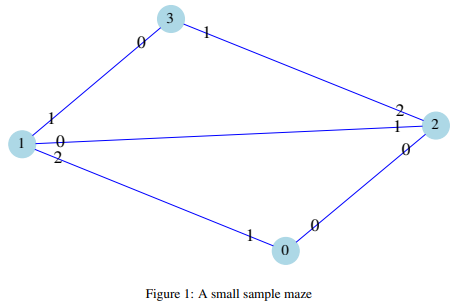

# University of Birmingham Data Structure and Algorithms Course

## Assignment 02

### 1 Introduction

This assignment will be marked out of 11 and **DOES** contribute to your module mark (11% of your final module mark).

Deadline for submission is:
**10:00 Monday 11th February**

With apologies to J.R.Tolkien, the dwarf mine under the mountain of Moria (c.f. https://en.wikipedia.org/wiki/Moria_(Middle-earth)) has been discovered and your job is to program a drone to explore this underground world and map out the maze formed by the chambers and connections between them.



There are an unknown number of chambers in the maze. Every chamber has a number of doorways (the doors themselves are no longer intact so there is no barrier to traversing the passageways or “wildlife” to deal with during the search). For simplicity, each chamber is numbered, starting at 0, and each doorway is numbered in each chamber, ranging from 0 to the number of doorways in the chamber minus 1.

Figure 1 indicates a sample maze (Moria itself has many more chambers). The numbers in the circles are the chamber numbers and the numbers on the lines are the doorway numbers. Thus doorway 1 of chamber 0 connects to doorway 2 of chamber 1, etc.

The drone always starts in chamber 0 and, after exploring the whole maze, should finish in chamber 0 as well. Your drone has access to a sensor system (a Maze class) that it can interrogate to identify which chamber it is currently in, how many doorways are visible in the current chamber and, when the drone proceeds through a doorway, which chamber it then enters and through which doorway. The sensors cannot tell you about any chamber that the drone is not currently in.

In summary, for this assignment you have to write the code to accomplish a number of tasks:

1.  Implement the code for a method to decide on which doorway to enter at each step during the search so that every chamber is explored and the drone ends up back in the start chamber (chamber 0).

2. Keep a record of every doorway that the drone passes through, either in leaving or in entering a chamber, to make it available at any point to the drone’s user (i.e. the caller).

3. In case of low battery, the drone must be able to calculate a direct route back (a sequence of doorways to take) to the start chamber from whatever chamber it is currently in. This route should avoid taking detours, loops or entering dead-ends that it then needs to backtrack out of.

### 2 Marking

* Any submission that passes all the tests in DroneTest.java, although on a range of different mazes other than just the one current used in that file, will get full marks.
 
* Further tests may be added during marking to distinguish between different ways that a submission that is not passing all the tests so that partial marks can be awarded.

* There will be 1 mark if your submission compiles correctly and can be run and passes the single test that already passes in the initial assignment files.

* If your submission is not structured correctly or does not compile, or crashes or enters an infinite loop before any tests pass, then no marks will be earned.

### 3 Plagiarism

Plagiarism will not be tolerated: it is unfair to the other students and prevents you from learning, and would give you a mark you don’t deserve, and qualifications you don’t deserve, hence being unfair to Society as a whole too. Please behave well and reward the module lecturer and TA’s by submitting your own, hard work.

All submissions will be checked for copying against other submissions and against sources on the web and elsewhere.
Any student found to have

When the module lecturer decides that there is evidence of plagiarism, the case will be forwarded to the Senior Tutor, who will look at the evidence and apply penalties and warnings, or, if necessary, forward this to the University.

* Guidance Notes on Plagiarism: https://www.cs.bham.ac.uk/internal/taught-students/plagiarism

* Copying is plagiarism: https://www.cs.bham.ac.uk/internal/taught-students/copying

* University regulations on plagiarism: https://intranet.birmingham.ac.uk/as/studentservices/conduct/plagiarism/index.aspx

### 4 Student Welfare

If you miss or are going to miss a deadline, or are getting behind the learning material, for reasons outside of your control, please contact Student Welfare. Occasionally students represent the University in sports, programming competitions, etc., and if this is going to affect your ability to comply with a deadline, Welfare should be informed. It is the Welfare Team, not the teaching team, who can award extensions and cancellations, and devise other measures to cope with adverse situations. It is important to contact welfare as soon as possible when such situations arise.

### 5 Background

While the first assignment was all about the internals of implementing pointers and list, this assignment is about using some of the available data structures in the Java standard library (the collection classes) so that you can avoid having to implement your own basic data structures but instead use the various standard lists, maps, arrays, queues and stacks, and their associated implemented algorithms, to solve your programming problems.

There is not a great deal of code that needs to be written, but the logic for some of it can be a bit involved, so please start on the assignment early and be diligent with your unit tests and study the identified classes in the JavaDoc.

The collection classes you will need to use are:

* ````Deque<>````: A Double Ended Queue interface with most commonly used implementations ````ArrayDeque<>```` and ````LinkedList<>````

&nbsp; &nbsp; &nbsp; &nbsp;You use the a Deque<> in Java as the standard way to implement both a Stack and a Queue as well as a Deque

* ````Set<>````: A Set interface with most commonly used implementations ````HashSet<>```` and ````TreeSet<>````

&nbsp; &nbsp; &nbsp; &nbsp;This implements the set abstract where we can add and remove elements and easily check whether an element is currently in the set.

* ````Map<>````: A Map interface with most commonly used implementations ````HashMap<>```` and ````TreeMap````

&nbsp; &nbsp; &nbsp; &nbsp;````Map<>```` has 2 type parameters. For example, a Map<String,Integer> provides a look up table that associates
&nbsp; &nbsp; &nbsp; &nbsp;String keys with Integer values so that you can add ask for the Integer that you have previously associated with a String: think of a phone book where you can look up phone numbers by the name of the person you want to call.
While you do not need to use Map<> collections in the code you write for this exercise, the Maze class uses them to store, and easily look up, the connections between chambers

* ````Collections```` and ````Arrays````: (Note that the “s” on the end of these class names are important!). These are library classes that provide many static utility functions that can make your life easier. You should browse through their methods so that you know what is available and thus avoid having to write methods that are already implemented there.

### 6 Setup and Specification

You have been provided with a Java project folder that contains sources and tests for this assignment: see the ````dsa_assignment2```` folder in the ````dsa_2019 GIT```` repository (don’t forget to do a ````“git pull”```` inside your copy of the repository to update it). You have been provided with the following files and packages:

````
dsa_assignment2/src/main/java/dsa_assignment2/
    Drone.java
    DroneInterface.java
    Maze.java
    Portal.java
````

````
dsa_assignment2/src/test/java/dsa_assignment2/
    DroneTest.java
````

If you set the top level ````dsa_assignment2```` as an Eclipse project, with ````src/main/java```` and ````src/test/java```` as the source folders on your build path, and add the user libraries for hamcrest-all (or hamcrest-core), JUnit and Log4J to your project, you should be able to compile and run the tests (all except one of which should fail!)

Your task is to add missing code to the methods in ````Drone.java```` to make all the tests pass.
* The precise information about the behaviour required of the missing code is detailed in the Javadoc comments in the ````Drone.java```` and ````DroneInterface.java```` files

* You should modify the ````Drone.getStudentId()```` and ````Drone.getStudentName()```` in ````Drone.java```` to return your student id and name.

* You should **NOT** add any further class variables to ````Drone.java````, or change the types of the existing class variables
nor modify any of the other files in the ````main```` part of the src tree. You can modify the ````DroneTest.java```` file or add
any other test files as you please. You should not modify the package structure or add any new classes that ````Drone .java```` depends upon to run. Your final submission will be purely the ````Drone.java```` file, so any modifications outside that file will not be considered and the ````Drone.java```` that you submit must work with the other files as they stand.

* You should not use any print statements to any files or to standard out or standard error streams: if you want to have
some debug output, use the logging calls for Log4j. The logging system will be switched to disable log output when your submission is run for marking purposes.

* For marking purposes, your code will be compiled and executed against a test set in a secure sandbox environment. Any attempts to break the security of the sandbox will cause the execution of your program to fail. This includes infinite loops in your code.

* When you have completed your code changes to your satisfaction, submit your ````Drone.java````

### 7 Getting Started

To help you see what is required, the following logging output from my solution to the problem, using the maze indicated in Fig. 1 is listed on the next page.

Further tips and advice about the assignment, and in particular about the algorithm to search the maze, will be forthcoming in an addendum to this handout. For the moment, please get the project up and running and start looking through the code. Try changing the parameters of the maze created in ````DroneTest.java```` and create the corresponding image file using the ````neato```` command.

````
dsa_assignment2.DroneTest.logMazeAndVisitsAndBackPath(DroneTest.java:38): 0 DEBUG: Maze in toString format:
1:0 -- 2:1
0:0 -- 2:0
1:1 -- 3:0
2:2 -- 3:1
0:1 -- 1:2
dsa_assignment2.DroneTest.logMazeAndVisitsAndBackPath(DroneTest.java:39): 2 DEBUG: Maze in dot format:
// Use the graphvis package to generate an image. Put this output in x.gv and run:
// neato -Tpng -ox.png x.gv
// to generate the x.png with the image of the connections. Alternatively, use
// "fdp" or "circo" with the same arguments to get a different layout
strict graph G {
size="6,6!" dpi=100 splines=true ratio=fill margin=0
edge[penwidth=0.2 color=blue forcelabels=true labelangle=0]
node[shape=circle margin=0.02 fixedsize=false
width=0.25 style=filled fontsize=12 color=lightblue]
1 -- 2 [taillabel=0 headlabel=1]
0 -- 2 [taillabel=0 headlabel=0]
1 -- 3 [taillabel=1 headlabel=0]
2 -- 3 [taillabel=2 headlabel=1]
0 -- 1 [taillabel=1 headlabel=2]
}
dsa_assignment2.DroneTest.logDroneVisitsAndBackPath(DroneTest.java:57): 3 TRACE: Drone search steps log Begin:
dsa_assignment2.DroneTest.logDroneVisitsAndBackPath(DroneTest.java:63): 3 TRACE: Current chamber: 2
Visit order: [0:0, 2:0]
Path back: [2:0]
dsa_assignment2.DroneTest.logDroneVisitsAndBackPath(DroneTest.java:63): 3 TRACE: Current chamber: 1
Visit order: [0:0, 2:0, 2:1, 1:0]
Path back: [1:0, 2:0]
dsa_assignment2.DroneTest.logDroneVisitsAndBackPath(DroneTest.java:63): 3 TRACE: Current chamber: 3
Visit order: [0:0, 2:0, 2:1, 1:0, 1:1, 3:0]
Path back: [3:0, 1:0, 2:0]
dsa_assignment2.DroneTest.logDroneVisitsAndBackPath(DroneTest.java:63): 3 TRACE: Current chamber: 2
Visit order: [0:0, 2:0, 2:1, 1:0, 1:1, 3:0, 3:1, 2:2]
Path back: [2:0]
dsa_assignment2.DroneTest.logDroneVisitsAndBackPath(DroneTest.java:63): 3 TRACE: Current chamber: 3
Visit order: [0:0, 2:0, 2:1, 1:0, 1:1, 3:0, 3:1, 2:2, 2:2, 3:1]
Path back: [3:0, 1:0, 2:0]
dsa_assignment2.DroneTest.logDroneVisitsAndBackPath(DroneTest.java:63): 3 TRACE: Current chamber: 1
Visit order: [0:0, 2:0, 2:1, 1:0, 1:1, 3:0, 3:1, 2:2, 2:2, 3:1, 3:0, 1:1]
Path back: [1:0, 2:0]
dsa_assignment2.DroneTest.logDroneVisitsAndBackPath(DroneTest.java:63): 3 TRACE: Current chamber: 0
Visit order: [0:0, 2:0, 2:1, 1:0, 1:1, 3:0, 3:1, 2:2, 2:2, 3:1, 3:0, 1:1, 1:2, 0:1]
Path back: []
dsa_assignment2.DroneTest.logDroneVisitsAndBackPath(DroneTest.java:63): 3 TRACE: Current chamber: 1
Visit order: [0:0, 2:0, 2:1, 1:0, 1:1, 3:0, 3:1, 2:2, 2:2, 3:1, 3:0, 1:1, 1:2, 0:1, 0:1, 1:2]
Path back: [1:2]
dsa_assignment2.DroneTest.logDroneVisitsAndBackPath(DroneTest.java:63): 4 TRACE: Current chamber: 2
Visit order: [0:0, 2:0, 2:1, 1:0, 1:1, 3:0, 3:1, 2:2, 2:2, 3:1, 3:0, 1:1, 1:2, 0:1, 0:1, 1:2, 1:0, 2:1]
Path back: [2:1, 1:2]
dsa_assignment2.DroneTest.logDroneVisitsAndBackPath(DroneTest.java:63): 4 TRACE: Current chamber: 0
Visit order: [0:0, 2:0, 2:1, 1:0, 1:1, 3:0, 3:1, 2:2, 2:2, 3:1, 3:0, 1:1, 1:2, 0:1, 0:1, 1:2, 1:0, 2:1, 2:0, 0:0]
Path back: []
dsa_assignment2.DroneTest.logDroneVisitsAndBackPath(DroneTest.java:67): 4 TRACE: Drone search steps log End
````